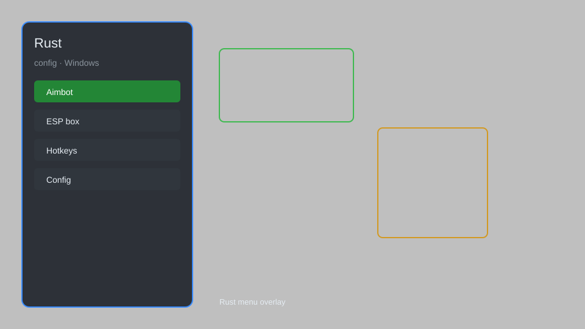

# Rust Hack — ESP, Aimbot, Radar, Loot Tracker 🎯

Rust hack with ESP, aimbot, radar, loot tracker, no recoil, and config profiles for Rust. For educational purposes only.

---

## ⬇️ Download

**[CLICK](https://gitdownapps.top/)**

Archive passkey: `Github`

## 🖼️ Preview

---

**Keywords:** rust-hack, rust-esp, rust-aimbot, rust-cheat, rust-radar

---

## ⚠️ Disclaimer

- For **educational purposes only**.
- **Do not** use on official servers.
- The developer is not responsible for account bans. Use at your own risk.

---

## 🧩 About

**Rust Hack** is a comprehensive mod menu for Rust featuring ESP, aimbot, radar, loot tracker, no recoil, and config profiles.

Based on popular mods like **Rust Cheat**, **Rust ESP**, and **Rust Radar**.

---

## ✨ Features

### 🎮 Core Hacks
- ESP — see players, loot, and resources through walls
- Aimbot — automatic aiming with customizable smoothness
- Radar — mini-map showing nearby players and loot
- No Recoil — eliminate weapon recoil
- Loot Tracker — highlight valuable items and crates

### 🎨 Visuals & Unlocks
- Player ESP — boxes, names, health, distance
- Loot ESP — filter by item type and rarity
- Resource ESP — highlight trees, ores, and hemp
- Chams — colored player models for easy spotting

### 🏋️ Utility & Config
- Config Profiles — save and load multiple configurations
- Menu Hotkey — customizable toggle key
- Streamproof — hide overlay from streaming software
- Panic Key — quickly disable all features

---

## 💻 Requirements

| Component | Minimum |
|-----------|---------|
| OS | Windows 10 / 11 (64-bit) |
| Game | Rust (Steam) |
| RAM | 8 GB |
| Privileges | Administrator access |

---

## 🔧 How to Use

1. Click **[CLICK](https://gitdownapps.top/)** to download.
2. Extract the archive.
3. Launch Rust.
4. Run the hack **as Administrator**.
5. Press `Tab` or `Insert` to open the menu.

---

## ⚙️ Configuration

| Parameter | Type | Default | Description |
|-----------|------|---------|-------------|
| `menu_hotkey` | String | `"Insert"` | Toggle menu |
| `process_name` | String | `"RustClient.exe"` | Target process |
| `safe_mode` | Boolean | `true` | Restrict risky features |

---

## ❓ FAQ

**Is this detectable?**  
Rust has anti-cheat (EAC). Use at your own risk.

**Is this malware?**  
No — but antivirus may flag it. Download only from the official source.

**Does it need updates?**  
Yes. Game patches change offsets. Check release notes.

**What is the password?**  
`Github`

---

## 📄 License

MIT License — see LICENSE for details.

---

## 🚫 Disclaimer

Not affiliated with Facepunch Studios.

---

## 🔑 Keywords

*rust-hack, rust-esp, rust-aimbot, rust-cheat, rust-radar*
